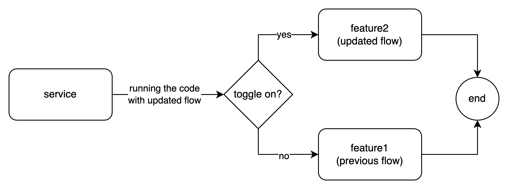

# Toggle Feature

## Description
Toggle feature will help the client or server side to switch between features. 

This feature will help you to handle the following scenarios:
1. lets say you have existing feature A and want to modify the flow, the development is half done and you need to deploy the service but dont want to impact the current production. So, you just set the new feature is toggle off (via if else logic)
2. you have existing page that have multiple page that can be access it via sidebar, the new page and the new sidebar already exist in production but the product team dont want it to release yet. So, you just set the new sidebar is toggle off (via if else logic)
3. you have updated flow in the production but in some case there are flows that causing incident, the new changes using toggle feature. So, to mitigate this issue you dont have to rollback the deployment but just toggle off the feature it will using the previous flow

## Prerequisite
- golang v1.23.0
- mongodb

## Endpoints
in this feature, currently there are five endpoints
- `get: /toggle-features?names=toggle1&names=toggle2` to get all toggle features with names are toggle1 and toggle2
- `get: /toggle-features/:id` to get the detail toggle features with specific id
- `post: /toggle-features` to create a new toggle
- `patch: /toggle-features/:id` to update a toggle with specific id
- `delete: /toggle-features/:id` to delete a toggle with specific id

## Usage
your service have feature1 (previous flow) that have multiple line of codes that following the business flow, lets say the flow are
1. create a new transaction record
2. reduce the current product stock

then there is a new requeirement to add another flow to send email notification, we call it feature2 (updated flow)
1. create a new transaction record
2. reduce the current product stock
3. send email notification

to ensure the updated flow not implemented in the production before the release date, we can encapsulate the additional new feature with a toggle (example toggle name: `send-email-feature` with default value `false`)



when the release date arrives we just activate the toggle, and when something bad happens we can deactivate the toggle then the service will return to using the previous flow.

since the toggle feature is so general, you can use this approach for other cases that need to switch between features or conditions

### Build docker
```
docker build --tag ibrohhm/toggle-feature . --platform linux/amd64
docker run --rm --name toggle-feature -p 8005:8005 -d ibrohhm/toggle-feature:latest
```
